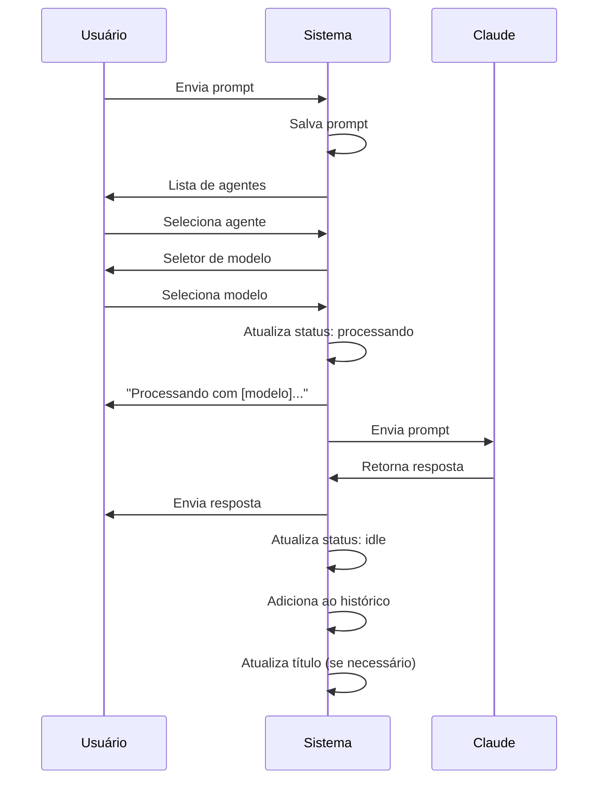

# Core Flows: Sistema Multi-Agente

## Visão Geral

Este documento descreve os fluxos de usuário do sistema multi-agente para o `file:claude-terminal`. Todos os fluxos acontecem via WhatsApp usando listas interativas e botões.

---

## 1. Primeira Experiência (Onboarding)

**Trigger:** Usuário envia primeiro prompt após instalação ou reset completo

**Fluxo:**
1. Usuário envia qualquer mensagem de texto
2. Sistema detecta que não há agentes criados
3. Sistema responde: "👋 Criando agente 'General' para você..."
4. Sistema cria agente "General" automaticamente (sem workspace)
5. Sistema mostra seletor de modelo: "Modelo:" [Haiku] [Opus]
6. Usuário seleciona modelo
7. Sistema processa o prompt com o agente General
8. Sistema responde com o resultado

**Resultado:** Usuário tem agente "General" pronto e seu primeiro prompt processado

---

## 2. Enviar Prompt (Fluxo Normal)

**Trigger:** Usuário envia mensagem de texto (não comando)

**Fluxo:**
1. Usuário envia prompt via WhatsApp
2. Sistema salva o prompt temporariamente
3. Sistema mostra lista interativa de agentes disponíveis:
   - Ordenados por: Prioridade (alta → média → baixa) + Última atividade
   - Cada item mostra:
     - Nome do agente
     - Título da conversa
     - Status + detalhes (ex: "idle - Aguardando prompt")
     - Timestamp (ex: "2min atrás")
4. Usuário seleciona agente da lista
5. Sistema mostra seletor de modelo: "Modelo:" [Haiku] [Opus]
6. Usuário seleciona modelo
7. Sistema atualiza status do agente: "processando - [prompt do usuário]..."
8. Sistema envia mensagem: "Processando com [modelo]..."
9. Claude processa o prompt
10. Sistema envia resposta do Claude
11. Sistema atualiza status do agente: "idle - Aguardando prompt"
12. Sistema adiciona output ao histórico do agente
13. Sistema atualiza título da conversa (se primeira msg ou a cada 10 msgs)

**Resultado:** Prompt processado, contexto preservado no agente selecionado

---

## 3. Enviar Prompt Durante Processamento

**Trigger:** Usuário envia prompt enquanto um ou mais agentes estão processando

**Fluxo:**
1. Usuário envia prompt via WhatsApp
2. Sistema salva o prompt temporariamente
3. Sistema detecta que há agentes em execução
4. Sistema mostra lista de agentes com indicação visual:
   - Agentes processando aparecem com status: "🔵 processando - [detalhes]..."
   - Agentes idle aparecem normalmente
   - Ordenação: Prioridade + Última atividade
5. Sistema mostra mensagem adicional: "⚠️ Agentes em execução: [lista de nomes]. Seu prompt será enfileirado se selecionar agente ocupado."
6. Usuário seleciona agente (pode ser um que está processando)
7. Sistema mostra seletor de modelo: "Modelo:" [Haiku] [Opus]
8. Usuário seleciona modelo
9. **Se agente selecionado está idle:**
   - Processa imediatamente (fluxo normal)
10. **Se agente selecionado está processando:**
    - Sistema envia: "Agente ocupado. Prompt enfileirado. Você será notificado quando iniciar."
    - Sistema adiciona prompt à fila do agente
    - Quando agente terminar tarefa atual, processa próximo da fila
    - Sistema notifica: "🔔 Agente [Nome] iniciou seu prompt: '[primeiras palavras]...'"

**Resultado:** Prompt enfileirado ou processado, dependendo da disponibilidade do agente

---

## 4. Criar Novo Agente

**Trigger:** Usuário seleciona "Criar novo agente" no menu principal

**Fluxo:**
1. Usuário envia "/" ou seleciona opção "Criar novo agente"
2. Sistema responde: "Nome do agente?"
3. Usuário envia nome (ex: "Backend API")
4. Sistema responde: "Workspace (opcional)? Envie o caminho completo ou 'pular'"
5. **Se usuário envia caminho:**
   - Sistema valida se caminho existe
   - Se válido: continua
   - Se inválido: "❌ Caminho não encontrado. Tente novamente ou envie 'pular'"
6. **Se usuário envia "pular":**
   - Agente criado sem workspace
7. Sistema cria agente com:
   - Nome fornecido
   - Workspace (se fornecido)
   - Prioridade: média (padrão)
   - Status: idle
   - Título: vazio (será gerado na primeira mensagem)
8. Sistema responde: "✅ Agente '[Nome]' criado!"
9. Sistema mostra botões: [Enviar prompt agora] [Depois]
10. **Se usuário clica "Enviar prompt agora":**
    - Sistema responde: "Envie seu prompt:"
    - Próxima mensagem do usuário vai para fluxo normal (passo 2)
11. **Se usuário clica "Depois":**
    - Retorna ao chat normal

**Resultado:** Novo agente criado e disponível para uso

---

## 5. Menu Principal (/)

**Trigger:** Usuário envia "/"

**Fluxo:**
1. Usuário envia "/"
2. Sistema mostra lista interativa com seções:

**Seção "🤖 Agentes"** (ordenados por prioridade + última atividade):
- Cada agente mostra:
  - Nome
  - Título da conversa
  - Status + detalhes
  - Timestamp
- Ao selecionar agente → vai para "Sub-menu do Agente" (fluxo 6)

**Seção "➕ Gerenciar":**
- "Criar novo agente" → vai para fluxo 4
- "Configurar execução" → vai para fluxo 8
- "Configurar prioridade" → vai para fluxo 9

**Seção "🔧 Comandos":**
- "/reset - Limpar sessão" → vai para fluxo 7
- "/compact - Compactar contexto" → comportamento atual
- "/help - Ajuda" → mostra ajuda atualizada

**Resultado:** Usuário navega para ação desejada

---

## 6. Sub-menu do Agente

**Trigger:** Usuário seleciona um agente no menu principal

**Fluxo:**
1. Usuário seleciona agente na lista
2. Sistema mostra opções para aquele agente:
   - "💬 Enviar prompt"
   - "📋 Ver histórico"
   - "⚙️ Configurar prioridade"
   - "🔄 Resetar agente"
   - "🗑️ Deletar agente"
   - "⬅️ Voltar"
3. **Se seleciona "Enviar prompt":**
   - Sistema: "Envie seu prompt:"
   - Próxima mensagem vai para esse agente (fluxo 2, pula seleção de agente)
4. **Se seleciona "Ver histórico":**
   - Vai para fluxo de histórico (fluxo 10)
5. **Se seleciona "Configurar prioridade":**
   - Vai para fluxo 9 (pré-selecionado esse agente)
6. **Se seleciona "Resetar agente":**
   - Sistema: "⚠️ Limpar sessão do agente '[Nome]'? Isso apagará todo o contexto."
   - Botões: [Confirmar] [Cancelar]
   - Se confirmar: limpa sessão, mostra "✅ Sessão limpa"
7. **Se seleciona "Deletar agente":**
   - Sistema: "⚠️ Deletar agente '[Nome]'? Isso é irreversível."
   - Botões: [Confirmar] [Cancelar]
   - Se confirmar: deleta agente, mostra "✅ Agente deletado"
8. **Se seleciona "Voltar":**
   - Retorna ao menu principal

**Resultado:** Usuário executa ação específica no agente

---

## 7. Resetar Agente(s)

**Trigger:** Usuário seleciona "/reset" no menu ou envia comando "/reset"

**Fluxo:**
1. Sistema mostra lista de agentes + opção especial:
   - Lista todos os agentes
   - Opção adicional: "🔄 Todos os agentes"
2. Usuário seleciona agente ou "Todos"
3. Sistema mostra confirmação:
   - **Se agente específico:** "⚠️ Limpar sessão do agente '[Nome]'? Isso apagará todo o contexto."
   - **Se todos:** "⚠️ Limpar TODAS as sessões? Isso apagará todo o contexto de todos os agentes."
4. Botões: [Confirmar] [Cancelar]
5. **Se confirmar:**
   - Sistema limpa sessão(ões)
   - Sistema responde: "✅ Sessão limpa" ou "✅ Todas as sessões limpas"
6. **Se cancelar:**
   - Sistema responde: "Operação cancelada"

**Resultado:** Sessão(ões) limpa(s), contexto removido

---

## 8. Configurar Limite de Execução Paralela

**Trigger:** Usuário seleciona "Configurar execução" no menu

**Fluxo:**
1. Sistema mostra configuração atual: "Limite atual: 3 agentes simultâneos"
2. Sistema mostra opções:
   - "1 agente"
   - "3 agentes" (padrão)
   - "5 agentes"
   - "10 agentes"
   - "Sem limite"
3. Usuário seleciona opção
4. Sistema atualiza configuração
5. Sistema responde: "✅ Limite atualizado para [N] agentes simultâneos"

**Resultado:** Limite de execução paralela configurado

---

## 9. Configurar Prioridade de Agente

**Trigger:** Usuário seleciona "Configurar prioridade" no menu

**Fluxo:**
1. Sistema mostra lista de agentes
2. Usuário seleciona agente
3. Sistema mostra prioridade atual e opções:
   - "Prioridade atual: [Média]"
   - Opções: [Alta] [Média] [Baixa]
4. Usuário seleciona nova prioridade
5. Sistema atualiza prioridade do agente
6. Sistema responde: "✅ Prioridade do agente '[Nome]' atualizada para [Alta/Média/Baixa]"

**Resultado:** Prioridade do agente atualizada, afeta ordenação nas listas

---

## 10. Visualizar Histórico de Agente

**Trigger:** Usuário seleciona "Ver histórico" no sub-menu do agente

**Fluxo:**
1. Sistema mostra lista interativa: "📋 Histórico - [Nome do Agente]"
2. Lista mostra últimos 10 outputs:
   - Cada item: "[emoji status] [resumo] - [tempo]"
   - Exemplo: "✅ Criou API REST endpoints - 2min"
   - Emojis: ✅ sucesso, ⚠️ warning, ❌ erro
3. Usuário clica em um item
4. Sistema mostra opções de ação:
   - "📄 Ver detalhes completos"
   - "🔄 Reexecutar este prompt"
   - "📋 Copiar resposta"
   - "⬅️ Voltar"
5. **Se seleciona "Ver detalhes":**
   - Sistema mostra:
     - Prompt original
     - Resposta completa do Claude
     - Modelo usado (Haiku/Opus)
     - Timestamp detalhado
6. **Se seleciona "Reexecutar":**
   - Sistema: "Reexecutar com qual modelo?" [Haiku] [Opus]
   - Processa novamente o prompt original
7. **Se seleciona "Copiar resposta":**
   - Sistema copia resposta (se WhatsApp suportar)
   - Mostra: "✅ Resposta copiada!"
8. **Se seleciona "Voltar":**
   - Retorna à lista de histórico

**Resultado:** Usuário visualiza e interage com histórico do agente

---

## 11. Tratamento de Erros

**Trigger:** Erro ocorre durante processamento de um agente

**Fluxo:**
1. Claude/Sistema encontra erro ao processar prompt
2. Sistema atualiza status do agente: "erro - [descrição breve]"
3. Sistema envia mensagem imediata:
   - "❌ Erro no agente '[Nome]'"
   - Descrição do erro
   - Botões: [Tentar novamente] [Ver log completo] [Ignorar]
4. **Se usuário clica "Tentar novamente":**
   - Sistema reexecuta o último prompt
   - Usa mesmo modelo da tentativa anterior
5. **Se usuário clica "Ver log completo":**
   - Sistema mostra erro detalhado
   - Stack trace (se disponível)
   - Sugestões de correção (se aplicável)
6. **Se usuário clica "Ignorar":**
   - Sistema mantém status de erro
   - Usuário pode continuar usando outros agentes
   - Erro fica visível no menu até próximo prompt bem-sucedido

**Resultado:** Usuário informado do erro e pode tomar ação de recuperação

---

## Princípios de Design

1. **Feedback constante:** Usuário sempre sabe o que está acontecendo
2. **Navegação clara:** Sempre há caminho de volta
3. **Confirmação em ações destrutivas:** Reset e delete pedem confirmação
4. **Priorização visual:** Agentes mais importantes aparecem primeiro
5. **Contexto preservado:** Trocar modelo não perde contexto
6. **Execução paralela transparente:** Usuário vê status de todos os agentes
7. **Recuperação de erros:** Sempre há opção de tentar novamente

---

## Notas de Implementação

- Todas as listas usam WhatsApp Interactive Lists (já implementado em `sendCommandsList`)
- Botões usam WhatsApp Interactive Buttons (já implementado em `sendModelSelector`)
- Ordenação de agentes: Prioridade (alta → média → baixa) + Última atividade (mais recente primeiro)
- Título da conversa: Atualizado na 1ª mensagem + a cada 10 mensagens + sob demanda
- Histórico: Mantém últimos 10 outputs por agente
- Status possíveis: idle, processando, erro