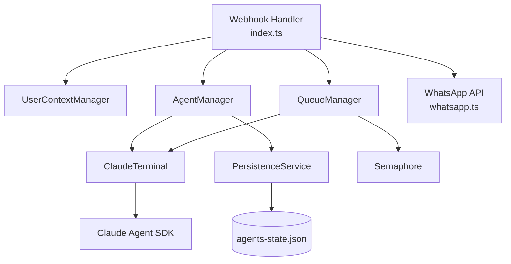
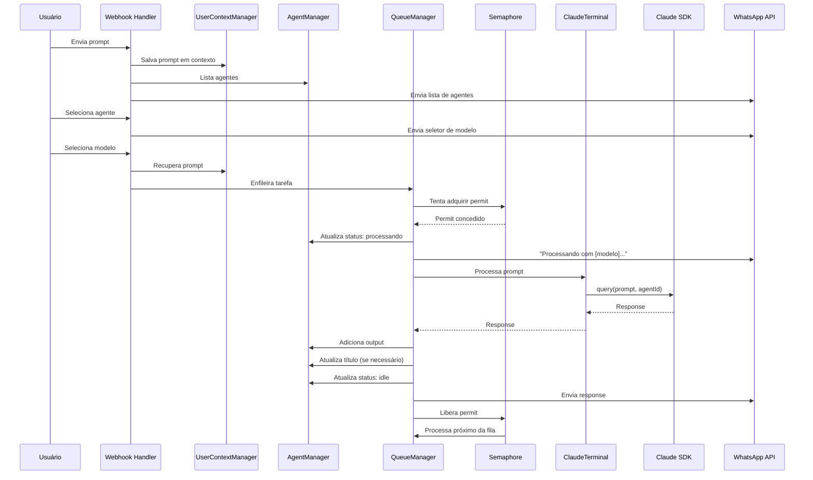

# Tech Plan: Sistema Multi-Agente

## Visão Geral

Este documento define a abordagem técnica de alto nível para transformar o claude-terminal em um sistema multi-agente. O design prioriza simplicidade, mantendo a filosofia do projeto (sem banco de dados, sem cloud), enquanto adiciona capacidades organizacionais robustas.

---

## 1. Architectural Approach

### Decisões Arquiteturais Principais

**1.1 Gerenciamento de Estado Conversacional**

Adotar **contexto por usuário estruturado** para rastrear fluxos multi-etapa (criação de agente, configuração, etc.).

```typescript
interface UserContext {
  userId: string
  currentFlow?: 'create_agent' | 'configure_priority' | 'configure_limit' | 'delete_agent'
  flowState?: 'awaiting_name' | 'awaiting_workspace' | 'awaiting_confirmation'
  flowData?: any
  pendingPrompt?: { text: string; messageId?: string }
}
```

**Rationale:**

- Estrutura clara para adicionar novos fluxos
- Separação entre estado conversacional e lógica de negócio
- Fácil de debugar e testar

**Trade-off:** Mais estruturado que `pendingPrompts` atual, mas necessário para múltiplos fluxos complexos.

---

**1.2 Sistema de Fila com Prioridade**

Implementar **fila global com prioridade** para gerenciar execução de prompts.

```typescript
interface QueueTask {
  id: string
  agentId: string
  prompt: string
  model: 'haiku' | 'opus'
  priority: number  // Derivado da prioridade do agente
  timestamp: Date
  userId: string
}
```

**Rationale:**

- Controle centralizado de execução
- Respeita prioridades de agentes automaticamente
- Facilita implementação do limite global de concorrência
- Agentes de alta prioridade processam primeiro

**Trade-off:** Mais complexo que fila por agente, mas necessário para priorização global.

---

**1.3 Controle de Concorrência**

Usar **Semaphore pattern** para limitar execuções paralelas.

```typescript
class Semaphore {
  private permits: number
  private waiting: Array<() => void> = []
  
  async acquire(): Promise<void>
  release(): void
}
```

**Rationale:**

- Padrão robusto e testado para controle de concorrência
- Evita race conditions
- Configurável (padrão: 3, sem limite máximo)

**Trade-off:** Requer implementação de Semaphore, mas é padrão simples e confiável.

---

**1.4 Geração de Título**

**Extrair título do próprio response** do Claude para economizar custos.

**Abordagem:**

- Incluir instrução no system prompt: "Ao final da resposta, sugira um título de 3-5 palavras no formato: [TITLE: ...]"
- Parser extrai título do response
- Fallback: primeiras 5 palavras do prompt se parsing falhar

**Rationale:**

- Zero custo adicional (sem chamada extra)
- Título contextualizado pela própria resposta
- Atualização automática a cada 10 mensagens (conforme spec)

**Trade-off:** Requer parsing confiável, mas economiza custos significativos.

---

**1.5 Persistência Híbrida**

**Metadados em JSON + Sessões Claude via SDK** (opção D com elementos de B).

**Estratégia:**

- Salvar metadados após operações críticas (criar/deletar agente, atualizar config)
- Sessões Claude persistem automaticamente via SDK
- Arquivo: `agents-state.json`

```json
{
  "version": "1.0",
  "config": {
    "maxConcurrent": 3
  },
  "agents": [
    {
      "id": "uuid",
      "name": "General",
      "workspace": null,
      "sessionId": "claude-session-id",
      "title": "Working on API",
      "status": "idle",
      "statusDetails": "Aguardando prompt",
      "priority": "medium",
      "lastActivity": "2024-01-01T12:00:00Z",
      "messageCount": 5,
      "outputs": [...]
    }
  ]
}
```

**Rationale:**

- Aproveita persistência nativa do Claude SDK
- Salva apenas o necessário
- Consistência garantida em operações críticas
- Recuperação completa após restart

**Trade-off:** Mais I/O que snapshot periódico, mas garante consistência.

---

**1.6 Separação de Responsabilidades**

Criar **AgentManager class** separada do `ClaudeTerminal`.

**Rationale:**

- `AgentManager`: CRUD de agentes, persistência, metadados
- `ClaudeTerminal`: Apenas interação com Claude SDK
- Separação clara de responsabilidades
- Facilita testes e manutenção

**Trade-off:** Arquivo adicional, mas código mais organizado e testável.

---

**1.7 Migração de Sessões**

**Aviso + escolha do usuário** ao detectar sessões antigas.

**Fluxo:**

1. Sistema detecta sessões com formato antigo (`${userId}_${model}`)
2. Envia mensagem: "⚠️ Detectadas sessões antigas. Deseja migrar para o novo sistema multi-agente?"
3. Opções: [Migrar] [Limpar tudo] [Cancelar]
4. Se migrar: cria agentes "Haiku" e "Opus" com sessões existentes
5. Se limpar: remove todas as sessões antigas

**Rationale:**

- Dá controle ao usuário
- Preserva contexto se desejado
- Evita surpresas

---

### Constraints e Considerações

**Constraints Técnicos:**

- Bun runtime (mantido)
- WhatsApp API via Kapso (mantido)
- Claude Agent SDK (mantido)
- Sem banco de dados (mantido)
- Sem servidores cloud (mantido)

**Considerações de Performance:**

- Fila global pode ter overhead com muitos agentes (aceitável para uso pessoal)
- Parsing de título pode falhar (fallback implementado)
- I/O de JSON após cada operação (aceitável para frequência baixa)

**Considerações de Segurança:**

- Validação de caminhos de workspace (prevenir path traversal)
- Sanitização de nomes de agentes
- Limite de agentes criados (prevenir abuso)

---

## 2. Data Model

### Entidades Principais

**2.1 Agent**

Representa um agente Claude independente.

```typescript
interface Agent {
  id: string                    // UUID
  name: string                  // Nome fornecido pelo usuário
  workspace?: string            // Caminho absoluto (opcional, imutável)
  sessionId?: string            // ID da sessão Claude (gerenciado pelo SDK)
  title: string                 // Título auto-gerado (3-5 palavras)
  status: 'idle' | 'processing' | 'error'
  statusDetails: string         // Ex: "Aguardando prompt", "Criando API endpoints..."
  priority: 'high' | 'medium' | 'low'
  lastActivity: Date
  messageCount: number          // Contador para atualização de título
  outputs: Output[]             // Últimos 10 outputs
  createdAt: Date
}
```

**Relacionamentos:**

- Um Agent tem uma sessão Claude (1:1)
- Um Agent tem múltiplos Outputs (1:N, limitado a 10)

---

**2.2 Output**

Representa um output/resposta do agente.

```typescript
interface Output {
  id: string
  summary: string               // Resumo da ação (ex: "Criou 3 arquivos")
  prompt: string                // Prompt original do usuário
  response: string              // Resposta completa do Claude
  model: 'haiku' | 'opus'       // Modelo usado
  status: 'success' | 'warning' | 'error'
  timestamp: Date
}
```

**Armazenamento:**

- Mantém apenas últimos 10 por agente (FIFO)
- Salvo no JSON junto com o agente

---

**2.3 UserContext**

Rastreia estado conversacional do usuário.

```typescript
interface UserContext {
  userId: string
  currentFlow?: 'create_agent' | 'configure_priority' | 'configure_limit' | 'delete_agent'
  flowState?: 'awaiting_name' | 'awaiting_workspace' | 'awaiting_confirmation' | 'awaiting_selection'
  flowData?: {
    agentName?: string
    agentId?: string
    workspace?: string
    priority?: string
    // ... outros dados específicos do fluxo
  }
  pendingPrompt?: {
    text: string
    messageId?: string
  }
}
```

**Armazenamento:**

- Apenas em memória (Map)
- Não persiste (estado temporário)

---

**2.4 QueueTask**

Representa uma tarefa na fila de execução.

```typescript
interface QueueTask {
  id: string
  agentId: string
  prompt: string
  model: 'haiku' | 'opus'
  priority: number              // 0-2 (high=0, medium=1, low=2)
  timestamp: Date
  userId: string
}
```

**Armazenamento:**

- Apenas em memória (PriorityQueue)
- Não persiste (processado ou descartado)

---

**2.5 SystemConfig**

Configurações globais do sistema.

```typescript
interface SystemConfig {
  maxConcurrent: number         // Padrão: 3
  version: string               // Versão do schema
}
```

**Armazenamento:**

- Salvo no JSON
- Carregado na inicialização

---

### Schema do Arquivo JSON

```json
{
  "version": "1.0",
  "config": {
    "maxConcurrent": 3
  },
  "agents": [
    {
      "id": "550e8400-e29b-41d4-a716-446655440000",
      "name": "General",
      "workspace": null,
      "sessionId": "claude-session-abc123",
      "title": "Working on API endpoints",
      "status": "idle",
      "statusDetails": "Aguardando prompt",
      "priority": "medium",
      "lastActivity": "2024-01-01T12:00:00.000Z",
      "messageCount": 5,
      "createdAt": "2024-01-01T10:00:00.000Z",
      "outputs": [
        {
          "id": "output-1",
          "summary": "Criou 3 arquivos",
          "prompt": "criar estrutura de API REST",
          "response": "Criei os seguintes arquivos...",
          "model": "opus",
          "status": "success",
          "timestamp": "2024-01-01T11:50:00.000Z"
        }
      ]
    }
  ]
}
```

---

### Mudanças no Sistema Existente

**ClaudeTerminal (**file:src/terminal.ts**):**

Mudança crítica na chave de sessão:

```typescript
// ANTES
function getSessionKey(userId: string, model: Model): string {
  return `${userId}_${model}`;
}

// DEPOIS
function getSessionKey(userId: string, agentId: string): string {
  return `${userId}_${agentId}`;
}
```

**Impacto:**

- Sessão única por agente (não por modelo)
- Trocar modelo mantém contexto
- Resolve problema principal do Epic Brief

---

## 3. Component Architecture

### Visão Geral dos Componentes



---

### 3.1 AgentManager

**Responsabilidades:**

- CRUD de agentes
- Gerenciar metadados (título, status, outputs)
- Persistência via PersistenceService
- Validações (nome, workspace)

**Interface:**

```typescript
class AgentManager {
  createAgent(name: string, workspace?: string): Agent
  deleteAgent(agentId: string): void
  getAgent(agentId: string): Agent | undefined
  listAgents(userId: string): Agent[]
  updateAgentStatus(agentId: string, status: Agent['status'], details: string): void
  updateAgentTitle(agentId: string, title: string): void
  addOutput(agentId: string, output: Output): void
  updatePriority(agentId: string, priority: Agent['priority']): void
  
  // Ordenação conforme spec
  listAgentsSorted(userId: string): Agent[]  // Por prioridade + última atividade
}
```

**Integração:**

- Usa `ClaudeTerminal` para interação com Claude
- Usa `PersistenceService` para salvar estado
- Chamado por webhook handler em file:src/index.ts

---

### 3.2 QueueManager

**Responsabilidades:**

- Gerenciar fila global com prioridade
- Respeitar limite de concorrência via Semaphore
- Processar tarefas em ordem de prioridade + FIFO
- Notificar usuário quando tarefa inicia

**Interface:**

```typescript
class QueueManager {
  constructor(semaphore: Semaphore, agentManager: AgentManager, terminal: ClaudeTerminal)
  
  enqueue(task: QueueTask): void
  processNext(): Promise<void>
  getQueueStatus(): { active: number; queued: number }
  
  // Chamado automaticamente quando semaphore libera
  private async processTask(task: QueueTask): Promise<void>
}
```

**Lógica de Prioridade:**

- Fila ordenada por: `priority` (0-2) → `timestamp` (FIFO)
- Agentes de alta prioridade (0) processam antes de média (1) e baixa (2)
- Dentro da mesma prioridade, FIFO

**Integração:**

- Usa `Semaphore` para controlar concorrência
- Usa `AgentManager` para atualizar status
- Usa `ClaudeTerminal` para processar prompts
- Usa `WhatsApp API` para notificar usuário

---

### 3.3 Semaphore

**Responsabilidades:**

- Controlar número de execuções paralelas
- Bloquear quando limite atingido
- Liberar quando tarefa termina

**Interface:**

```typescript
class Semaphore {
  constructor(permits: number)
  
  async acquire(): Promise<void>
  release(): void
  availablePermits(): number
}
```

**Implementação:**

- Contador de permits disponíveis
- Fila de Promises aguardando
- Resolve Promises quando permits liberados

---

### 3.4 UserContextManager

**Responsabilidades:**

- Rastrear estado conversacional por usuário
- Gerenciar fluxos multi-etapa
- Limpar contexto após conclusão

**Interface:**

```typescript
class UserContextManager {
  getContext(userId: string): UserContext | undefined
  setContext(userId: string, context: UserContext): void
  clearContext(userId: string): void
  
  // Helpers para fluxos específicos
  startCreateAgentFlow(userId: string): void
  isInFlow(userId: string): boolean
  getCurrentFlow(userId: string): string | undefined
}
```

**Armazenamento:**

- Map em memória
- Não persiste (estado temporário)

---

### 3.5 PersistenceService

**Responsabilidades:**

- Salvar/carregar estado do JSON
- Validar schema
- Migração de versões (futuro)

**Interface:**

```typescript
class PersistenceService {
  save(state: { config: SystemConfig; agents: Agent[] }): void
  load(): { config: SystemConfig; agents: Agent[] } | null
  
  // Migração
  detectOldSessions(): boolean
  migrateOldSessions(): void
}
```

**Arquivo:**

- Localização: `./agents-state.json`
- Formato: JSON com schema versionado
- Backup: Cria `.bak` antes de sobrescrever

---

### 3.6 TitleExtractor

**Responsabilidades:**

- Extrair título do response do Claude
- Fallback se parsing falhar

**Interface:**

```typescript
class TitleExtractor {
  extract(response: string, prompt: string): string
  
  // Parsing: procura por [TITLE: ...] no response
  // Fallback: primeiras 5 palavras do prompt
}
```

**Formato esperado no response:**

```
[resposta do Claude...]

[TITLE: Working on API endpoints]
```

---

### 3.7 Modificações em Componentes Existentes

file:src/index.ts **(Webhook Handler):**

Mudanças principais:

- Instanciar novos componentes (AgentManager, QueueManager, etc.)
- Usar `UserContextManager` para rastrear estado
- Delegar para `QueueManager` ao invés de processar diretamente
- Adicionar handlers para novos comandos (criar agente, configurar, etc.)

file:src/terminal.ts **(ClaudeTerminal):**

Mudanças principais:

- Mudar `getSessionKey` para usar `agentId` ao invés de `model`
- Adicionar suporte a workspace (passar como working directory ao SDK)
- Remover lógica de sessão por modelo

file:src/whatsapp.ts**:**

Adicionar novas funções:

- `sendAgentsList`: Lista de agentes com metadados
- `sendAgentMenu`: Sub-menu de um agente
- `sendHistoryList`: Lista de outputs
- `sendErrorWithActions`: Erro com botões de recuperação

---

### Fluxo de Dados End-to-End

**Exemplo: Enviar Prompt**



---

### Failure Modes e Recuperação

**1. Crash durante processamento:**

- Status do agente fica "processing"
- Na reinicialização: detecta agentes em "processing", reseta para "idle"
- Usuário pode reenviar prompt

**2. Erro do Claude SDK:**

- Capturado em `QueueManager.processTask`
- Status atualizado para "error" com detalhes
- Mensagem enviada ao usuário com opções de recuperação
- Semaphore liberado para não bloquear fila

**3. Corrupção do JSON:**

- `PersistenceService.load` valida schema
- Se inválido: carrega do `.bak` (backup)
- Se ambos inválidos: inicia com estado vazio + agente "General"

**4. Workspace inválido:**

- Validado em `AgentManager.createAgent`
- Se inválido: rejeita criação, pede novo caminho
- Agente não é criado até workspace válido

**5. Fila cheia (muitas tarefas):**

- Sem limite de tamanho de fila (aceitável para uso pessoal)
- Se necessário no futuro: adicionar limite + rejeitar com mensagem

---

### Considerações de Implementação

**Ordem de Implementação Sugerida:**

1. `Semaphore` (independente, testável)
2. `AgentManager` + `PersistenceService` (core)
3. `UserContextManager` (estado conversacional)
4. `TitleExtractor` (utilitário)
5. `QueueManager` (orquestração)
6. Modificar `ClaudeTerminal` (mudança de sessão)
7. Modificar `index.ts` (integração)
8. Adicionar funções em `whatsapp.ts` (UI)

**Testes Críticos:**

- Concorrência do Semaphore
- Ordenação da fila por prioridade
- Persistência e recuperação do JSON
- Parsing de título (com fallback)
- Migração de sessões antigas

**Performance:**

- Fila global: O(log n) para inserção (heap)
- Listagem de agentes: O(n log n) para ordenação
- Persistência: O(n) para serialização
- Aceitável para uso pessoal (< 100 agentes)

---

## Resumo das Decisões Técnicas


| Aspecto               | Decisão                          | Rationale                                   |
| --------------------- | -------------------------------- | ------------------------------------------- |
| Estado conversacional | Contexto por usuário estruturado | Escalável, organizado                       |
| Fila de execução      | Fila global com prioridade       | Controle centralizado, respeita prioridades |
| Concorrência          | Semaphore pattern                | Robusto, evita race conditions              |
| Título                | Extrair do response              | Zero custo, contextualizado                 |
| Persistência          | Metadados JSON + sessões SDK     | Aproveita SDK, salva apenas necessário      |
| Organização           | AgentManager separado            | Separação de responsabilidades              |
| Migração              | Aviso + escolha do usuário       | Controle ao usuário, preserva contexto      |
| Sessão                | `${userId}_${agentId}`           | Contexto preservado entre modelos           |


